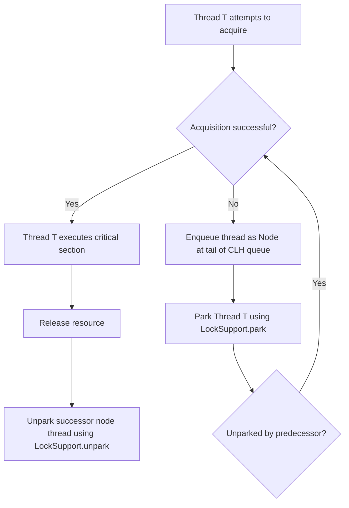
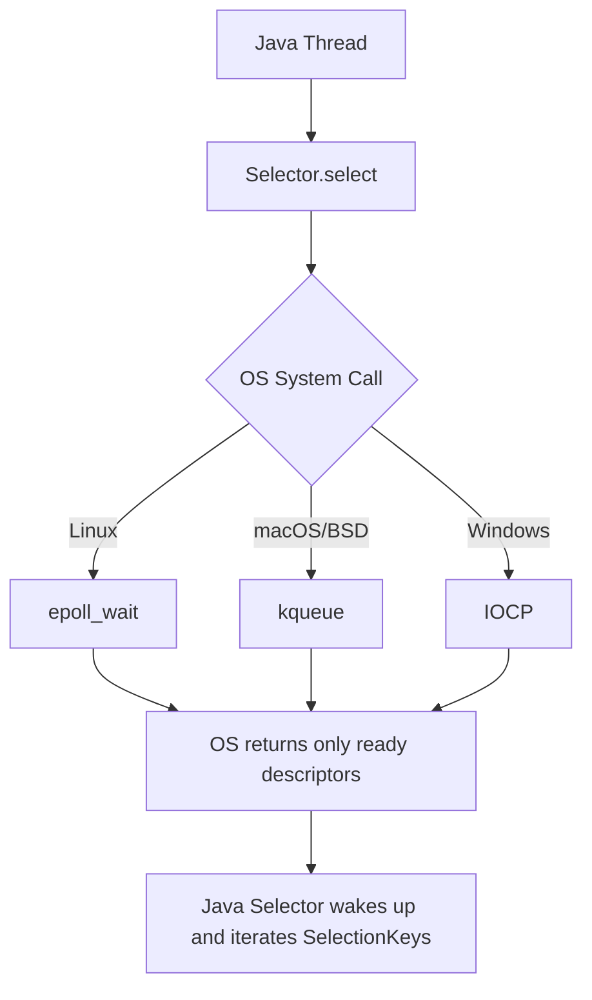
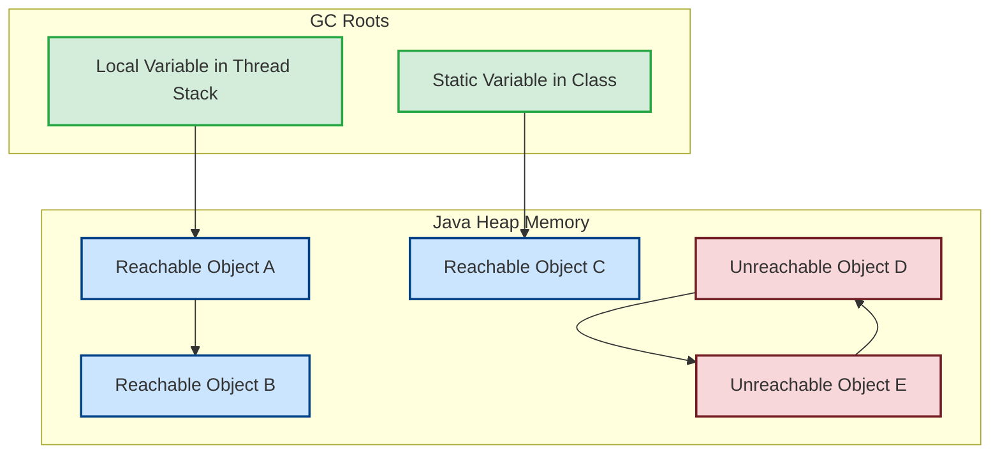
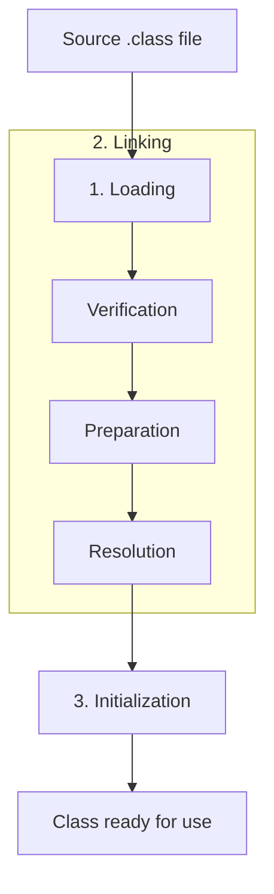
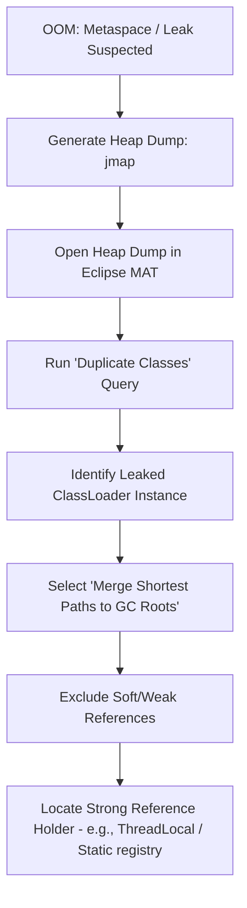
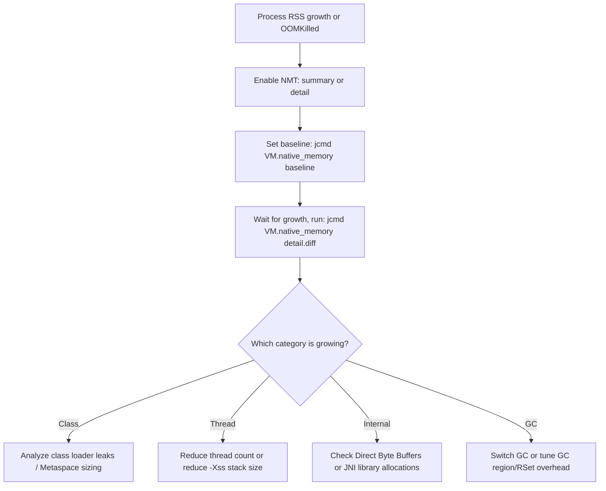
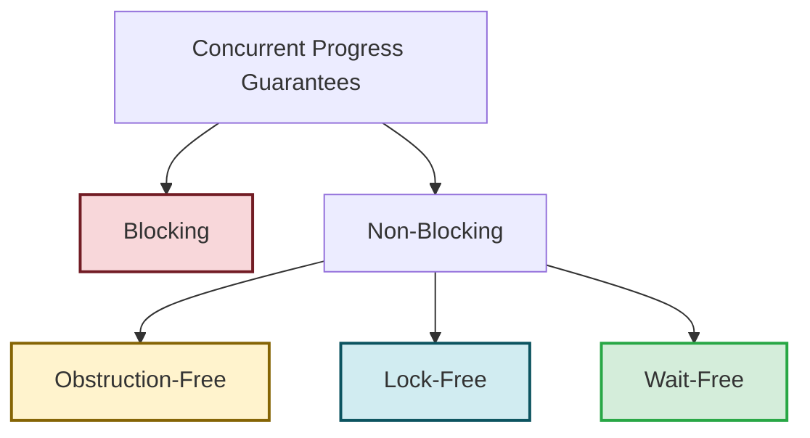

# Java Interview Questions (Advanced Level)

## 151. What is `AbstractQueuedSynchronizer` (AQS) in Java, and how does it serve as the foundation for modern concurrency utilities like `ReentrantLock`, `Semaphore`, and `CountDownLatch`?

`AbstractQueuedSynchronizer` (commonly known as **AQS**), located in the `java.util.concurrent.locks` package, is a framework and a state-based template class designed for building locks and other synchronizers (such as semaphores, barriers, and latches) that rely on first-in-first-out (FIFO) wait queues.

Designed by Doug Lea, AQS handles the low-level, complex mechanics of thread queuing, synchronization state management, and thread blocking/unblocking, allowing developers to write custom synchronizers by implementing only a few high-level methods.

---

### 1. The Core Architecture of AQS

AQS manages synchronization using three main components:

1. **State (`state`)**: A single, `volatile int` variable representing the lock/synchronizer state. AQS provides thread-safe access to this state via:
   - `getState()`
   - `setState(int newState)`
   - `compareAndSetState(int expect, int update)` (utilizes hardware-level Compare-And-Swap (CAS) to update the state atomically).
2. **CLH Queue (Wait Queue)**: A variant of the Craig, Landin, and Hagersten (CLH) lock queue. It is a FIFO, doubly-linked list of `Node` objects. Each node represents a blocked thread waiting for the lock/synchronizer to release.
3. **Exclusive vs. Shared Modes**:
   - **Exclusive Mode (e.g., `ReentrantLock`)**: Only a single thread can hold the resource at any given time. If one thread acquires the state, all other threads attempting to acquire it must wait.
   - **Shared Mode (e.g., `CountDownLatch`, `Semaphore`)**: Multiple threads can successfully acquire the state concurrently.

---

### 2. How AQS Operates Under the Hood

The lifetime of a thread interacting with an AQS-based synchronizer generally flows through these phases:



#### A. Acquisition Flow
1. A thread attempts to acquire the lock/state.
2. If the attempt fails (because the state is already owned or unavailable), AQS creates a new `Node` for the current thread and appends it to the tail of the double-linked CLH queue using a CAS loop to ensure thread safety.
3. Once in the queue, the thread is suspended (parked) using `LockSupport.park(this)`.
4. The thread yields CPU execution and remains parked until it is explicitly unparked by its predecessor node when the state is released.

#### B. Release Flow
1. A thread releases the resource by updating the `state` variable.
2. AQS checks if the new state value permits waiting threads to proceed.
3. If so, it identifies the successor node (the next thread in the queue) and wakes it up using `LockSupport.unpark(thread)`.

---

### 3. The Template Method Pattern in AQS

AQS uses the **Template Method Design Pattern**. It defines the overall structure of locking, queuing, and unparking in its `public final` methods (like `acquire()`, `release()`, `acquireShared()`, `releaseShared()`). Subclasses do not modify these queuing operations. Instead, they define their own state acquisition rules by overriding the following `protected` methods:

| Method Signature | Mode | Description |
| :--- | :--- | :--- |
| `tryAcquire(int arg)` | Exclusive | Attempts to acquire the resource in exclusive mode. Returns `true` if successful. |
| `tryRelease(int arg)` | Exclusive | Attempts to release the resource in exclusive mode. Returns `true` if successful. |
| `tryAcquireShared(int arg)` | Shared | Attempts to acquire the resource in shared mode. Returns a negative integer on failure, `0` on success but no subsequent shared acquires can succeed, or a positive integer if success and subsequent shared acquires may succeed. |
| `tryReleaseShared(int arg)` | Shared | Attempts to release the resource in shared mode. Returns `true` if the release may allow waiting threads to acquire. |
| `isHeldExclusively()` | N/A | Returns `true` if synchronization is held exclusively with respect to the current thread. |

If a subclass does not implement a method, the base AQS class throws an `UnsupportedOperationException`.

---

### 4. How Standard Java Synchronizers Map to AQS

Modern concurrency utilities implement AQS by wrapping it in an internal static helper class (conventionally named `Sync`), which overrides the necessary template methods:

#### A. `ReentrantLock`
- **AQS Mode**: Exclusive.
- **State Semantics**: `state` represents the acquisition count.
  - `state == 0`: The lock is free.
  - `state > 0`: The lock is held. A thread can re-acquire the lock, incrementing `state` (supporting reentrancy).
- **Behavior**: `tryAcquire` succeeds if `state == 0` or if the current thread is the owner. `tryRelease` decrements the state, releasing the lock fully only when `state` reaches `0`.

#### B. `Semaphore`
- **AQS Mode**: Shared.
- **State Semantics**: `state` represents the number of available permits.
- **Behavior**: `tryAcquireShared(acquires)` subtracts the requested permits from the current state. If the result is >= 0, the acquisition succeeds. `tryReleaseShared(releases)` adds permits back to the state using a CAS loop.

#### C. `CountDownLatch`
- **AQS Mode**: Shared.
- **State Semantics**: `state` represents the remaining countdown latch count.
- **Behavior**: `await()` calls `acquireSharedInterruptibly(1)`, which blocks as long as `state > 0`. `countDown()` calls `releaseShared(1)`, which decrements the state. When `state` reaches `0`, the AQS finisher unparks all waiting threads.

---

### 5. Code Example: Implementing a Custom Mutual Exclusion Lock

The following code demonstrates how to implement a basic, non-reentrant custom mutual exclusion (mutex) lock using AQS:

```java
import java.util.concurrent.TimeUnit;
import java.util.concurrent.locks.AbstractQueuedSynchronizer;
import java.util.concurrent.locks.Condition;
import java.util.concurrent.locks.Lock;

public class CustomMutex implements Lock {

    // 1. Define the internal AQS helper class
    private static class Sync extends AbstractQueuedSynchronizer {
        
        // Reports whether the lock is held
        @Override
        protected boolean isHeldExclusively() {
            return getState() == 1;
        }

        // Acquires the lock if state is 0
        @Override
        protected boolean tryAcquire(int acquires) {
            assert acquires == 1; // Mutex requires exactly 1 acquire
            if (compareAndSetState(0, 1)) {
                setExclusiveOwnerThread(Thread.currentThread());
                return true;
            }
            return false;
        }

        // Releases the lock by resetting state to 0
        @Override
        protected boolean tryRelease(int releases) {
            assert releases == 1; // Mutex requires exactly 1 release
            if (getState() == 0) {
                throw new IllegalMonitorStateException();
            }
            setExclusiveOwnerThread(null);
            setState(0);
            return true;
        }

        // Provides a condition interface
        Condition newCondition() {
            return new ConditionObject();
        }
    }

    // 2. Delegate Lock operations to the Sync helper instance
    private final Sync sync = new Sync();

    @Override
    public void lock() {
        sync.acquire(1);
    }

    @Override
    public void lockInterruptibly() throws InterruptedException {
        sync.acquireInterruptibly(1);
    }

    @Override
    public boolean tryLock() {
        return sync.tryAcquire(1);
    }

    @Override
    public boolean tryLock(long time, TimeUnit unit) throws InterruptedException {
        return sync.tryAcquireNanos(1, unit.toNanos(time));
    }

    @Override
    public void unlock() {
        sync.release(1);
    }

    @Override
    public Condition newCondition() {
        return sync.newCondition();
    }
}
```

---

### Summary

- **AQS** acts as a unified skeleton framework for Java synchronizers, hiding the complexity of thread queuing, parking, and waking.
- It relies on a **`volatile int state`** representing the synchronization state, and a **doubly-linked CLH queue** of waiting threads.
- Subclasses use the **Template Method pattern**, implementing only the rules for state transition (`tryAcquire`, `tryRelease`, etc.) using lock-free CAS instructions, while AQS handles thread safety and scheduling under the hood.

---

## 152. How does Java NIO (Non-blocking I/O) achieve scalability compared to traditional blocking I/O (BIO)? Explain the roles of Buffers, Channels, and Selectors, and how they map to OS-level I/O multiplexing (such as `epoll` or `kqueue`).

Traditional Java Blocking I/O (BIO) relies on a **thread-per-connection** model. When a server handles thousands of concurrent clients, it must allocate a dedicated thread for each socket connection. Since threads block on read/write operations, this model consumes massive memory (JVM thread stack overhead) and degrades performance due to constant CPU context switching.

Java Non-blocking I/O (NIO) (introduced in Java 1.4 and enhanced with NIO.2 in Java 7) addresses this limitation by using **I/O multiplexing**, allowing a single thread (or a small pool of threads) to manage multiple concurrent socket channels.

---

### 1. The Core Components of Java NIO

Java NIO is built around three primary abstractions:

#### A. Buffers (`java.nio.Buffer`)
Unlike BIO, where data is read directly from and written to streams (`InputStream`/`OutputStream`) byte-by-byte, NIO reads and writes data via **Buffers**. A Buffer is a contiguous memory block that acts as a temporary container.
- **Direct Buffers (`ByteBuffer.allocateDirect`)**: Allocated outside the standard JVM garbage-collected heap (off-heap memory) via native system calls. Direct buffers avoid copying data between the JVM heap and the native OS buffer during network I/O, yielding higher throughput.
- **Non-Direct Buffers (`ByteBuffer.allocate`)**: Standard heap-allocated buffers that are subject to Garbage Collection.

#### B. Channels (`java.nio.channels.Channel`)
A Channel represents an open connection to an entity capable of I/O operations (e.g., a file, socket, or pipe).
- **Bidirectional**: Unlike BIO streams, which are unidirectional (e.g., `FileInputStream` can only read), Channels can perform both read and write operations.
- **Non-Blocking Support**: Channels (such as `SocketChannel` and `ServerSocketChannel`) can be placed in non-blocking mode (`channel.configureBlocking(false)`), allowing read/write attempts to return immediately instead of pausing execution.

#### C. Selectors (`java.nio.channels.Selector`)
A Selector is a multiplexer of `SelectableChannel` objects. A single thread registers multiple channels with a Selector, along with the interest events it wants to monitor:
- `SelectionKey.OP_ACCEPT`: Server socket is ready to accept a new connection.
- `SelectionKey.OP_CONNECT`: Client socket completed its connection handshake.
- `SelectionKey.OP_READ`: Channel has data ready to be read.
- `SelectionKey.OP_WRITE`: Channel is ready to write data.

---

### 2. Mapping NIO to OS-Level I/O Multiplexing

Under the hood, Java NIO does not implement the selection logic itself. Instead, the JVM delegates it to the underlying Operating System's I/O multiplexing system calls.



#### A. `select()` and `poll()` (The Legacy $O(N)$ Approach)
Older OS multiplexing models like `select()` and `poll()` require the kernel to iterate over a list of all monitored file descriptors to see which ones are ready. When a socket has data, the system call wakes up the application, which must also loop through the entire list ($O(N)$ complexity). This degrades rapidly as the number of connections grows.

#### B. `epoll` (Linux) and `kqueue` (macOS/BSD) (The Scalable $O(1)$ Approach)
Modern operating systems use event-driven system calls. When using `epoll` on Linux:
1. **Registration**: When a channel is registered with a Selector, Java calls `epoll_ctl()` to add the socket's file descriptor to the OS interest list.
2. **Waiting**: Calling `Selector.select()` triggers `epoll_wait()`. The thread goes to sleep.
3. **Interrupt Event**: When data arrives at a network interface card (NIC), the NIC triggers a hardware interrupt. The kernel handles the packet and pushes the socket's file descriptor directly into a **ready list** (event queue).
4. **Wake Up**: The `epoll_wait()` call returns immediately with *only* the file descriptors in the ready list. The thread wakes up. The complexity of finding ready connections is $O(1)$, independent of the total number of idle connections.

---

### 3. Code Example: Implementing a Simple NIO Echo Server

The following code illustrates a single-threaded server managing multiple connections using `Selector`:

```java
import java.io.IOException;
import java.net.InetSocketAddress;
import java.nio.ByteBuffer;
import java.nio.channels.*;
import java.util.Iterator;
import java.util.Set;

public class NioEchoServer {
    public static void main(String[] args) throws IOException {
        // 1. Open Server Socket Channel and Selector
        ServerSocketChannel serverChannel = ServerSocketChannel.open();
        Selector selector = Selector.open();

        serverChannel.bind(new InetSocketAddress("localhost", 8080));
        serverChannel.configureBlocking(false); // Set to non-blocking

        // 2. Register Server Channel with Selector for ACCEPT events
        serverChannel.register(selector, SelectionKey.OP_ACCEPT);
        System.out.println("Echo server started on port 8080...");

        ByteBuffer buffer = ByteBuffer.allocate(256);

        // 3. Event loop
        while (true) {
            // Blocks until at least one registered channel has an event
            selector.select();

            Set<SelectionKey> selectedKeys = selector.selectedKeys();
            Iterator<SelectionKey> keyIterator = selectedKeys.iterator();

            while (keyIterator.hasNext()) {
                SelectionKey key = keyIterator.next();
                keyIterator.remove(); // Prevent reprocessing the same key

                if (key.isAcceptable()) {
                    // Accept the incoming connection
                    SocketChannel clientChannel = serverChannel.accept();
                    clientChannel.configureBlocking(false);
                    // Register the client channel for READ events
                    clientChannel.register(selector, SelectionKey.OP_READ);
                    System.out.println("Accepted connection from: " + clientChannel.getRemoteAddress());
                } 
                
                else if (key.isReadable()) {
                    SocketChannel clientChannel = (SocketChannel) key.channel();
                    buffer.clear();
                    int bytesRead = clientChannel.read(buffer);

                    if (bytesRead == -1) {
                        // Connection closed by client
                        System.out.println("Connection closed by: " + clientChannel.getRemoteAddress());
                        clientChannel.close();
                    } else if (bytesRead > 0) {
                        // Echo the received data back to the client
                        buffer.flip(); // Prepare buffer for reading/writing out
                        clientChannel.write(buffer);
                    }
                }
            }
        }
    }
}
```

---

### 4. Comparison: Java BIO vs. Java NIO

| Feature | Java BIO (Blocking I/O) | Java NIO (Non-blocking I/O) |
| :--- | :--- | :--- |
| **I/O Model** | Stream-oriented (Unidirectional). | Buffer & Channel-oriented (Bidirectional). |
| **Blocking Behavior**| Blocking (Thread halts until operation finishes). | Non-blocking (Thread can poll or multiplex events). |
| **Concurrency Model**| Thread-per-connection (Scales poorly). | Reactor / Event-Loop using Selector (Scales well). |
| **OS Mechanism** | Sequential system calls (`read`/`write`). | OS I/O multiplexing (`epoll`, `kqueue`, `IOCP`). |
| **Best Suited For** | Low-concurrency, simple, high-bandwidth streaming. | High-concurrency, low-latency, many short-lived connections. |

---

### Summary

- **Java NIO** achieves high scalability by decoupling connections from threads through **I/O multiplexing**.
- **Buffers** act as the memory carriers (with direct buffers bypassing JVM heap copy overhead), while **Channels** act as non-blocking conduits.
- The **Selector** acts as the central orchestrator, delegating connection monitoring to OS-level constructs like **`epoll`** (Linux) or **`kqueue`** (macOS) to achieve $O(1)$ event notifications, enabling a single thread to handle tens of thousands of active channels.

---

## 153. How does the `final` keyword guarantee initialization safety under the Java Memory Model (JMM)? Explain "freeze semantics", "Safe Publication", and the danger of the "escaped `this`" reference during construction.

In Java, thread safety often requires synchronization (such as `synchronized` blocks or `volatile` variables) to ensure memory visibility and prevent instruction reordering. However, the **`final`** keyword provides a unique, highly optimized exception to this rule: **initialization safety**.

Under the Java Memory Model (JMM), `final` fields are guaranteed to be fully initialized and visible to any thread by the time the object is constructed, even if the object reference is shared via an unsynchronized path.

---

### 1. The JMM Guarantee for `final` Fields

Without the special semantics of `final`, when thread A creates an object and thread B reads it, thread B can observe a partially initialized state. This happens because the compiler or CPU can reorder the write to the object's fields to occur *after* the write of the object's reference to memory.

For example, with standard fields:
```java
// Thread A
x = new Holder(); // steps: 1. allocate, 2. write fields, 3. publish reference

// Thread B
if (x != null) {
    int value = x.val; // Thread B can see x != null, but x.val still as 0 (default)!
}
```
However, JSR-133 (implemented in Java 5) guarantees that **if a field is declared `final`, any thread reading the field after the object's constructor completes is guaranteed to see the value assigned inside the constructor**, without any synchronization.

---

### 2. Under the Hood: "Freeze Semantics" and Compiler Fences

The JVM enforces this guarantee using **freeze semantics** at the hardware/compilation level:

1. **The Freeze Operation**: When a constructor completes, the compiler performs a "freeze" on all `final` fields of the class.
2. **Memory Barrier (Fence)**: To implement this freeze, the JIT compiler inserts a **`StoreStore` memory barrier** (or similar CPU fence) at the end of the constructor, immediately before returning the object's reference.
3. **Preventing Reordering**: The `StoreStore` barrier ensures that all store instructions initializing the `final` fields are committed to memory (or made visible to cache coherence protocols) *before* the store instruction publishing the object's reference itself.

```
Thread A (Constructing):
[Initialize final fields] -> [StoreStore Fence (Freeze)] -> [Publish Object Reference]
                                   |
                             (Guarantees)
                                   v
Thread B (Reading):
[Read Object Reference]   -> [LoadLoad Fence (Implicit)] -> [Read final fields (guaranteed initialized)]
```

---

### 3. The Pre-requisite: "Safe Publication"

The initialization safety of `final` fields is only active if the object is **safely published**. Safe publication means that a reference to the newly created object does not become visible to other threads until *after* the constructor has finished execution.

If an object is published *during* its construction (unsafe publication), other threads can see the object in an incomplete state, causing the JVM to bypass `final` field guarantees.

---

### 4. The Danger of the "Escaped `this`" Reference

The most common way to violate safe publication is to allow the **`this`** reference of the object to escape from the constructor before it finishes.

#### Common Ways `this` Escapes:
1. **Starting a Thread in the Constructor**: Spawning a thread that accesses instance fields before the constructor returns.
2. **Registering Listeners or Callbacks**: Passing `this` to an external registry or event bus.
3. **Leaking to static variables**: Assigning `this` to a globally accessible static reference.

#### Code Example: The Escaped `this` Bug
The following code demonstrates how an escaping `this` reference allows another thread to observe a default value for a `final` field:

```java
public class DangerousConstructor {
    public static DangerousConstructor globalInstance;
    
    // final field - should be immutable and safely initialized
    public final int answerToLife;
    public int nonFinalValue;

    public DangerousConstructor() {
        // DANGER: Leaking 'this' to a static variable before constructor finishes!
        globalInstance = this;

        // Simulate some initialization latency
        try {
            Thread.sleep(50);
        } catch (InterruptedException ignored) {}

        this.answerToLife = 42;
        this.nonFinalValue = 100;
    }
}
```

If Thread B concurrently polls `globalInstance`, it can read the reference after it is assigned in line 10 but *before* lines 18-19 run:

```java
// Thread B running concurrently
public void checkInstance() {
    DangerousConstructor instance = DangerousConstructor.globalInstance;
    if (instance != null) {
        // Since 'this' escaped, JMM guarantees are voided!
        System.out.println(instance.answerToLife); // Can print 0 (default int value)!
        System.out.println(instance.nonFinalValue); // Can print 0
    }
}
```

#### The Safe Alternative: Factory Methods
To prevent `this` from escaping, never start threads or register listeners inside constructors. Use a private constructor and a static factory method:

```java
public class SafeConstructor {
    private final int answerToLife;
    private final EventListener listener;

    // Private constructor: Safe from escaping
    private SafeConstructor(int value) {
        this.answerToLife = value;
        this.listener = () -> System.out.println("Event received!");
    }

    // Static factory method: Publishes only fully constructed objects
    public static SafeConstructor createInstance(EventSource source, int value) {
        SafeConstructor obj = new SafeConstructor(value);
        
        // Safe to register because the constructor has fully returned and fields are frozen
        source.registerListener(obj.listener);
        
        return obj;
    }
}
```

---

### 5. Summary and Comparison

| Synchronization Mechanism | Core Guarantee | Runtime Overhead | JIT Compilation Effect |
| :--- | :--- | :--- | :--- |
| **`final`** | One-time **initialization safety** for the field. | Zero overhead on reads. | Inserts a `StoreStore` barrier at the end of the constructor. |
| **`volatile`** | **Visibility and Ordering** guarantees for all reads/writes. | Read/write memory barriers (`StoreLoad`, `LoadLoad`, etc.). | Prevents compiler/hardware reorderings around the field. |
| **`synchronized`** | **Mutual Exclusion**, Visibility, and Atomicity. | Monitor acquisition lock/unlock overhead. | Restricts concurrent block entry and flushes CPU caches. |

---

### Summary

- The JMM guarantees that **`final` fields** will be fully initialized and visible to all threads without explicit synchronization, provided the object reference does not escape before the constructor finishes.
- The JVM implements this guarantee using **freeze semantics**, placing a memory barrier at the end of the constructor to prevent the field writes from being reordered with the object publication.
- Allowing **`this` to escape** during construction completely bypasses this safety mechanism, potentially exposing default uninitialized values (like `0` or `null`) of `final` fields to other threads.

---

## 154. What are GC Roots in Java? Explain the different types of GC Roots, how the JVM uses them to perform reachability analysis during garbage collection, and how reference-chain memory leaks occur.

All modern Java garbage collectors (such as G1, ZGC, Parallel, and Serial) use a **tracing** mechanism rather than simple reference counting to determine which objects are eligible for reclamation. The core of this tracing process is **reachability analysis**, which begins from a set of special, inherently alive references called **GC Roots**.

An object is considered **live** (and thus protected from garbage collection) if there is a chain of references (a path in the directed object graph) that connects a GC Root to that object. If no such path exists, the object is considered unreachable and becomes eligible for GC, even if it is part of an isolated cycle of objects referencing each other.

---

### 1. Reachability Analysis Visualized

The garbage collector builds a directed graph of all objects in memory. The roots of this graph are the GC Roots.



* **Reachable Objects (A, B, C)**: Kept alive because they have a path to a GC Root.
* **Unreachable Objects (D, E)**: Reclaimed by the GC because they are not reachable from any GC Root. Notice that even though D and E reference each other (a circular reference), they are still garbage collected.

---

### 2. Types of GC Roots in the HotSpot JVM

In Java, an object is a GC Root if it fits into one of the following categories:

| GC Root Type | Description |
| :--- | :--- |
| **Thread Stack Variables** | Local variables, parameters, and references residing in the stack frames of all active Java threads. When a thread executes a method, any reference on the stack is a GC Root. |
| **Static Fields** | References declared as `static` inside loaded classes. These are permanent roots for the lifetime of their class loaders, as class metadata is held in Metaspace. |
| **JNI Native References** | Local and global references created inside native C/C++ code via the Java Native Interface (JNI). These refer to objects on the JVM heap but are tracked outside the heap. |
| **JVM Internal References** | References held directly by the JVM system, such as system class loaders, active JVM threads, system exception caches, or the constant pool. |
| **Active Synchronizers** | Monitor locks (`synchronized` blocks) and lock synchronizers (like `AbstractQueuedSynchronizer` instances) that are currently held or being waited on by threads. |

---

### 3. Tracing GC vs. Reference Counting

| Feature | Reference Counting (e.g., Python/Swift) | Reachability Analysis / Tracing (Java) |
| :--- | :--- | :--- |
| **Mechanism** | Updates a counter for every reference added or removed. | Traces references starting from GC Roots during a GC sweep. |
| **Circular References** | Fails to detect cyclic loops, resulting in memory leaks unless weak references are used. | Handles cycles effortlessly since unreachable groups are ignored. |
| **Runtime Overhead** | Continuous CPU overhead for pointer assignments. | Zero overhead during application execution; overhead occurs in GC cycles. |
| **Reclamation Timing** | Immediate (deterministic) when count hits zero. | Deferred (non-deterministic); occurs when GC cycles are triggered. |

---

### 4. How Reference-Chain Memory Leaks Occur

Unlike languages with manual memory management (like C/C++ where leaks occur when references are lost and memory is never freed), **memory leaks in Java occur when objects that are no longer needed remain reachable from a GC Root**.

Since the objects are still reachable, the GC is forced to treat them as live and cannot reclaim them, eventually leading to a `java.lang.OutOfMemoryError: Java heap space`.

#### Common Memory Leak Patterns in Java:

#### A. Unbounded Static Collections
Static fields are GC Roots. If you append objects to a static collection and forget to remove them, they are leaked forever.

```java
import java.util.HashMap;
import java.util.Map;

public class SessionManager {
    // GC Root: Static Map
    private static final Map<String, UserSession> activeSessions = new HashMap<>();

    public static void createSession(String token, UserSession session) {
        activeSessions.put(token, session);
    }

    // Bug: If we forget to call this when a user logs out, the UserSession leaks
    public static void removeSession(String token) {
        activeSessions.remove(token);
    }
}
```
* **Reference Chain**: `System Class Loader` $\rightarrow$ `Class SessionManager` $\rightarrow$ `static Map activeSessions` $\rightarrow$ `Map Node` $\rightarrow$ `UserSession` (Leaked object).

#### B. Uncleared `ThreadLocal` Variables
`ThreadLocal` instances store values inside the active `Thread` object's internal thread-local map. For pooled thread environments (like Tomcat or custom executor services), threads run forever. If you don't call `.remove()`, the cached values remain pinned to the thread stack context.

```java
public class RequestContext {
    private static final ThreadLocal<UserContext> userThreadLocal = new ThreadLocal<>();

    public static void set(UserContext context) {
        userThreadLocal.set(context);
    }

    // Bug: Must be called in a 'finally' block of the request handler!
    public static void clear() {
        userThreadLocal.remove();
    }
}
```
* **Reference Chain**: `Active Worker Thread (GC Root)` $\rightarrow$ `ThreadLocalMap` $\rightarrow$ `ThreadLocalMap$Entry` $\rightarrow$ `UserContext` (Leaked object).

#### C. Unregistered Listeners and Callbacks
If a short-lived object registers itself as a listener to a long-lived publisher but fails to unregister, the publisher retains a strong reference to it.

---

### 5. Troubleshooting Reference Chain Leaks

To find the source of a memory leak:
1. **Generate a Heap Dump**: Automatically via `-XX:+HeapDumpOnOutOfMemoryError` or manually using:
   ```bash
   jcmd <pid> GC.heap_dump /path/to/heapdump.hprof
   ```
2. **Examine with Analyzer (e.g., Eclipse MAT)**:
   - Identify candidate leaked classes (e.g., classes with unexpected instance counts).
   - Right-click the class/object and select **Merge Shortest Paths to GC Roots** or **Path to GC Roots** and choose **Exclude Soft/Weak/Phantom References**.
   - This returns the direct chain of strong references holding the object in memory, pointing directly to the GC Root (like a specific thread or static collection) causing the leak.

---

### Summary

- **GC Roots** are references that are inherently alive (e.g., local variables on thread stacks, JNI handles, static fields, and active JVM system references).
- The JVM uses **reachability analysis** starting from these roots to trace and preserve live objects. Unreachable objects (even those with circular references) are reclaimed.
- **Java memory leaks** are caused by reference chains that keep unused objects linked to an active GC Root.
- Memory leaks can be diagnosed by generating a heap dump and analyzing the **path to GC Roots** using memory profilers, focusing exclusively on strong references.

---

## 155. What is the JVM Class Loading and Linking lifecycle? Explain the stages of Loading, Linking (Verification, Preparation, and Resolution), and Initialization, and how the JVM guarantees thread safety and handles circular dependencies during this process.

In Java, class loading is a dynamic process. Classes are loaded, linked, and initialized on demand (when they are first referenced at runtime) rather than at JVM startup. 

The JVM executes this lifecycle in three distinct phases: **Loading**, **Linking**, and **Initialization**. Understanding the precise transitions between these phases, how class-level locks are managed, and how circular dependencies behave is critical for troubleshooting classloader deadlock scenarios, bootstrap order issues, and unexpected class initialization state bugs.

---

### 1. The Three Phases of the Class Lifecycle

The JVM specification defines a structured sequence of states through which every class or interface must progress.



#### A. Phase 1: Loading
Loading is the process of acquiring the binary representation of a class (the raw byte array of a `.class` file) and generating the corresponding metadata in JVM memory.
1. **Locating the Bytes:** A `ClassLoader` locates the bytecode matching the class name from a JAR, directory, network socket, or runtime generation.
2. **Metaspace Allocation:** The JVM parses the byte array and constructs internal runtime data structures (like the constant pool, methods, and fields) in **Metaspace**.
3. **Class Instance Creation:** The JVM creates an instance of `java.lang.Class` on the Java heap to represent this class programmatically.

#### B. Phase 2: Linking
Linking combines the class metadata into the runtime state of the JVM so it can be executed. Linking consists of three sub-phases:

1. **Verification:**
   - **Purpose:** Ensures the bytecode is safe and structurally valid.
   - **Checks:** Verifies that stack heights match instruction requirements, local variable types are correct, no illegal stack overflows/underflows occur, and private/protected access modifiers are respected.
   - **Cost:** This is the most computationally expensive phase of class loading.

2. **Preparation:**
   - **Purpose:** Allocates memory for static fields and initializes them to their **system default values** (not the values assigned in the code).
   - *Example:* For `public static int count = 10;`, the field `count` is initialized to `0` during Preparation, *not* `10`. Similarly, reference variables are set to `null`, and booleans to `false`.

3. **Resolution:**
   - **Purpose:** Translates symbolic references in the class's constant pool into direct memory pointers.
   - *Example:* If a class references `java.lang.System.out`, the constant pool contains a string reference to it. Resolution parses the target class and fields, replacing the string with the actual physical memory address.
   - **Timing:** Resolution can be **lazy** (resolved only when the instruction is first executed) or **eager** (resolved during linking).

#### C. Phase 3: Initialization
Initialization is the execution of the class initializer block `<clinit>`. This is where static block initializers and static variable assignments are executed.
- The JVM executes static assignments and `static { ... }` blocks in the order they appear in the source code.
- During this phase, `public static int count = 10;` is finally updated from `0` to `10`.

---

### 2. Thread Safety During Class Loading and Initialization

Because multiple threads can concurrently trigger the loading of the same class, the JVM must guarantee thread safety.

#### A. Class Loading Lock
During Phase 1 (Loading), class loaders protect the loading process using a lock. 
- In modern JVMs, class loaders are **parallel capable** (`ClassLoader.registerAsParallelCapable()`).
- Instead of locking the entire class loader instance (which bottlenecked classic Java systems), the JVM uses a concurrent hash map to retrieve or create a dedicated lock object for each specific class name:
  ```java
  protected Object getClassLoadingLock(String className) {
      Object lock = this;
      if (parallelLockMap != null) {
          Object newLock = new Object();
          lock = parallelLockMap.putIfAbsent(className, newLock);
          if (lock == null) {
              lock = newLock;
          }
      }
      return lock;
  }
  ```

#### B. Class Initialization Lock
During Phase 3 (Initialization), the JVM must ensure that `<clinit>` runs exactly once.
- The JVM uses an internal **Initialization Lock** (associated with the class's `java.lang.Class` instance) to synchronize access.
- The state of class initialization is tracked internally using states like `not_initialized`, `being_initialized`, `fully_initialized`, or `initialization_error`.
- **Initialization Protocol:**
  1. Thread A attempts to initialize class `X`. It acquires the class's initialization lock.
  2. The state changes to `being_initialized` by Thread A. Thread A releases the lock and begins executing `<clinit>`.
  3. Thread B attempts to access class `X` concurrently. It sees the state is `being_initialized`. Thread B acquires the initialization lock, checks that it is not the thread doing the initializing, and blocks (waits) on the lock until Thread A finishes.
  4. Once Thread A completes `<clinit>`, it sets the state to `fully_initialized`, wakes up all waiting threads, and releases the lock.

---

### 3. Circular Dependencies and Deadlocks during Class Initialization

If Class A's `<clinit>` references Class B, and Class B's `<clinit>` references Class A, how does the JVM prevent deadlocks or infinite recursion?

#### A. Single-Threaded Circular Reference (Recursion Prevention)
If a single thread triggers a circular initialization path (Thread T initializes A, which triggers B, which triggers A again):
1. Thread T sets A to `being_initialized` by Thread T.
2. Thread T invokes B's initialization.
3. B's `<clinit>` references A, triggering A's initialization check.
4. Thread T checks A's state, sees A is `being_initialized` **by the current thread (Thread T)**.
5. Instead of blocking or recursing, Thread T **returns immediately** and continues executing B's static block.
6. **The Catch:** Because A is not yet fully initialized, B will see the **default values** (preparation values) of A's static fields, which can cause subtle runtime bugs.

#### B. Multi-Threaded Circular Reference (Initialization Deadlock)
If Thread 1 triggers initialization of Class A, and Thread 2 concurrently triggers initialization of Class B, and both classes reference each other:
1. Thread 1 locks A and sets it to `being_initialized` by Thread 1.
2. Thread 2 locks B and sets it to `being_initialized` by Thread 2.
3. Thread 1 tries to access B. It blocks because B is `being_initialized` by Thread 2.
4. Thread 2 tries to access A. It blocks because A is `being_initialized` by Thread 1.
5. **Result:** An active JVM-level deadlock. Standard Java thread dumps (`jstack`) will *not* show this as a traditional lock deadlock because these are internal JVM monitor waits, making them extremely difficult to diagnose.

---

### 4. Code Example: Demonstrating Preparation vs. Initialization & Single-Threaded Circular Bugs

The following code illustrates how static initializers execute, and how circular dependency results in reading uninitialized values:

```java
public class CircularInitializationDemo {
    public static void main(String[] args) {
        System.out.println("Main started");
        System.out.println("ClassA.value: " + ClassA.value);
        System.out.println("ClassB.value: " + ClassB.value);
    }
}

class ClassA {
    // During Preparation: ClassA.value is set to 0.
    // During Initialization: triggers ClassB initialization.
    public static final int value = ClassB.value + 10; 
    
    static {
        System.out.println("ClassA initialized");
    }
}

class ClassB {
    // During Preparation: ClassB.value is set to 0.
    // During Initialization: triggers ClassA initialization (already being initialized by current thread).
    // It reads ClassA.value as its prepared value (0), instead of 10.
    public static final int value = ClassA.value + 5; 

    static {
        System.out.println("ClassB initialized");
    }
}
```

#### Output of Execution:
```text
Main started
ClassB initialized
ClassA initialized
ClassA.value: 15
ClassB.value: 5
```

#### Tracing the Execution:
1. `main` references `ClassA.value`, triggering Class A's initialization.
2. The JVM acquires the initialization lock for Class A, sets its state to `being_initialized`.
3. To compute `ClassA.value`, the JVM must resolve `ClassB.value`, triggering Class B's initialization.
4. The JVM acquires the initialization lock for Class B, sets its state to `being_initialized`.
5. To compute `ClassB.value`, the JVM must resolve `ClassA.value`. It checks Class A's state and sees it is `being_initialized` by the *same thread*.
6. Instead of blocking, the JVM reads Class A's current prepared value, which is `0`.
7. `ClassB.value` is calculated as `0 + 5 = 5`.
8. Class B's initialization finishes, setting state to `fully_initialized`.
9. The JVM returns to Class A's initialization. `ClassA.value` is calculated as `ClassB.value + 10 = 5 + 10 = 15`.
10. Class A's initialization finishes.

---

### Summary

- **Class Loading** consists of three phases: **Loading** (retrieving bytecode), **Linking** (Verification, Preparation, and Resolution), and **Initialization** (executing `<clinit>`).
- During **Preparation**, static fields are allocated memory and given their system default values (e.g., `0` or `null`). They are only assigned actual values during **Initialization**.
- The JVM coordinates class loading via class-loader locks, and class initialization via class-level locks to ensure thread safety.
- **Circular dependencies** between classes during initialization are resolved by allowing the same thread to bypass blocking and read partially initialized states, which can cause unexpected default values to propagate. If different threads trigger the circular path concurrently, a JVM deadlock occurs.

---

## 156. What are JIT Compiler Intrinsics in the HotSpot JVM? How do they differ from standard JNI (Java Native Interface) calls, and how do they optimize performance for core JDK methods like `Math.sin`, `System.arraycopy`, and `Unsafe` operations?

In Java, call overhead is generally low, but for certain performance-critical, low-level operations (like memory copying, trigonometry, string searches, or atomic CPU operations), standard method invocation and bytecode translation introduce unacceptable latency. 

To achieve maximum execution speed, the HotSpot JVM leverages **JIT Compiler Intrinsics**. Intrinsics are core Java library methods whose bytecodes are bypassed during compilation. Instead, the JIT compiler (C1 or C2) replaces calls to these methods directly with hand-written, highly optimized native machine assembly instructions tailored to the target CPU architecture.

---

### 1. How Intrinsics Differ from standard Java Bytecode and JNI

Historically, when Java developers wanted to write highly optimized code that executed at hardware speeds, they resorted to **Java Native Interface (JNI)**. However, JNI is notoriously slow for small, frequently-called methods due to invocation boundary overhead. 

```
Standard Java JNI Call:
[Java Caller] ──> [JNI Wrapper (Stack/Argument Translation)] ──(Cross OS Boundary)──> [C/C++ Native Function]

JIT Compiler Intrinsic:
[Java Caller] ──(Compiled Inline directly to Caller's Assembly)──> [CPU Hardware Instructions]
```

The differences between standard bytecode execution, JNI calls, and JIT intrinsics are summarized below:

| Feature | Standard Java Bytecode | Java Native Interface (JNI) | JIT Compiler Intrinsic |
| :--- | :--- | :--- | :--- |
| **Compilation Path** | Compiled into standard JVM bytecode; JIT-compiled to assembly at runtime. | Compiled to a separate native library (`.dll`/`.so`) using a C/C++ compiler. | The JIT compiler intercepts the method call and inserts pre-defined assembly templates inline. |
| **Call Overhead** | Low (subject to method inlining). | High (requires stack frame adjustments, JNI environment setups, and GC safepoint transitions). | **Zero** (compiled inline directly into the caller's stream of instructions). |
| **Inlining Support** | Yes (if JIT heuristics allow). | No (cannot be inlined by the JIT compiler across the native boundary). | **Always** (natively inlined by design). |
| **Hardware Optimization** | Limited to standard compiler optimizations and auto-vectorization heuristics. | Limited by compile-time options of the native C/C++ library compiler. | Maximum (specifically utilizes native CPU features like SIMD/AVX-512, AES-NI, and atomic CAS instructions). |

---

### 2. Common Categories of JIT Intrinsics in the JDK

The HotSpot JVM registers hundreds of intrinsics. They fall into several main functional categories:

#### A. Mathematical Functions (`java.lang.Math`)
Methods like `Math.sin()`, `Math.cos()`, `Math.sqrt()`, and `Math.log()` are intrinsified. 
- Instead of executing Java loops or invoking native libraries, the JIT compiler replaces `Math.sqrt(x)` directly with CPU-specific floating-point square root instructions (e.g., `sqrtsd` on x86/x64 or `fsqrt` on ARM).

#### B. Block Memory Transfers (`java.lang.System`)
The signature `System.arraycopy(Object src, int srcPos, Object dest, int destPos, int length)` is a well-known intrinsic.
- Copying memory element-by-element in bytecode is highly inefficient. The JIT compiler replaces the call with native hardware instructions designed for fast block memory copying (such as `rep movsb` on Intel, or vectorized SIMD transfer loops).

#### C. Atomic Operations and Memory Barriers (`sun.misc.Unsafe` / `java.lang.invoke.VarHandle`)
Low-level concurrency primitives like `compareAndSwapInt()` or `compareAndSet()` cannot be expressed in standard Java bytecode.
- The JIT compiler compiles these directly into hardware-level atomic instructions (e.g., a lock-prefixed Compare-and-Exchange `lock cmpxchg` instruction on x86 architectures).

#### D. Vectorized String and Array Searching (`java.lang.String`)
Methods like `String.indexOf()`, `String.equals()`, and `String.compareTo()` are intrinsically optimized.
- HotSpot generates vectorized loops that scan 16, 32, or 64 bytes at a time using SSE4.2, AVX2, or AVX-512 vector instructions. This allows a string equality check or substring search to run significantly faster than a standard byte-by-byte loop.

#### E. Cryptographic Operations (`sun.security.*`)
Core cryptographic routines (like AES encryption/decryption, SHA digest hashing) are intrinsified to utilize hardware acceleration features directly (e.g., Intel AES-NI instructions).

---

### 3. How HotSpot Implements Intrinsics Under the Hood

The JVM identifies candidate intrinsic methods using internal tables.

1. **Registration:** Intrinsics are declared inside the JVM source code in `vmSymbols.hpp` and `vmIntrinsics.hpp` using the `do_intrinsic` macro, mapping Java method descriptors (e.g., `java/lang/Math.sin(D)D`) to internal IDs (e.g., `_dsin`).
2. **JIT Interception:** During compilation, when the C2 (Server) compiler parses the bytecode of the caller method and encounters an invocation instruction (like `invokestatic` to `Math.sin`), it checks the target method's intrinsic ID.
3. **Bypassing Bytecode:** If the method is an intrinsic, the compiler completely ignores the target method's bytecode.
4. **Node Injection:** It injects a specialized hardware-agnostic compilation node (e.g., `SinNode` or `ArrayCopyNode`) into the compiler's Intermediate Representation (IR) graph (the "Sea-of-Nodes").
5. **Platform Assembly Generation:** During the code generation phase, the architecture-specific backend of the JIT compiler translates this node into the most optimal instruction sequence for the actual processor the JVM is running on.

---

### 4. Diagnosing and Monitoring JIT Intrinsics

You can verify whether a method is being intrinsified by inspecting compilation logs or executing diagnostic commands.

#### A. JVM PrintIntrinsics Flag
To see a printout of intrinsics as they are compiled, use the following JVM diagnostic options:
```bash
java -XX:+UnlockDiagnosticVMOptions -XX:+PrintCompilation -XX:+PrintIntrinsics -jar app.jar
```

#### B. Interpreting the Compilation Log
If a method is successfully replaced with an intrinsic, you will see output like:
```text
  73   1       java.lang.System::arraycopy (0 bytes)   (intrinsic)
  82   2       java.lang.Math::sqrt (0 bytes)   (intrinsic)
  95   3       java.lang.StringUTF16::equals (44 bytes)   (intrinsic)
```
- **`(intrinsic)`** confirms that the compiler bypassed the method's bytecode (indicated by `0 bytes` compiled size for mathematical functions or standard lengths) and replaced it with a hardware assembly template.

---

### Summary

- **JIT Compiler Intrinsics** are special Java methods replaced directly by the JIT compiler with hand-crafted native assembly instructions.
- Unlike **JNI**, intrinsics incur **zero call overhead** and are compiled inline directly into the caller's machine code, bypassing the OS and JVM native boundary transitions.
- Common intrinsics include high-performance routines in `java.lang.Math`, `java.lang.String` searching, `System.arraycopy`, and atomic operations in `Unsafe` or `VarHandle`.
- Intrinsics allow the JVM to automatically utilize CPU hardware extensions (such as SIMD/AVX vectorization, AES-NI, and hardware lock primitives) dynamically at runtime.

---

## 157. What are ClassLoader Memory Leaks in Java? Explain the reference chain that keeps ClassLoaders alive, common leak patterns (such as ThreadLocals and System Threads), and how to diagnose them using Heap Dump analysis tools.

In Java, ClassLoader memory leaks are among the most difficult issues to diagnose and resolve. They manifest as a gradual, irreversible increase in native heap usage, eventually culminating in a `java.lang.OutOfMemoryError: Metaspace` (or `PermGen` in Java 7 and older). 

Unlike standard memory leaks where objects are kept alive on the heap, a ClassLoader leak occurs when class metadata remains pinned in native memory because the ClassLoader that loaded them cannot be garbage collected.

---

### 1. The Reference Chain of a ClassLoader Leak

To understand ClassLoader leaks, it is crucial to recognize that **individual classes cannot be unloaded by the JVM**. The JVM can only reclaim memory for classes in bulk by garbage-collecting the entire `ClassLoader` instance that loaded them.

The JVM maintains a complex web of strong references between objects, classes, and ClassLoaders:

```
[GC Root (e.g., Thread Stack)] 
       │ (strong reference)
       ▼
 [Leaked Object Instance]
       │ (header / instance type pointer)
       ▼
  [Class Object]
       │ (internal JVM reference)
       ▼
 [ClassLoader Instance] ──(strong reference list)──► [All Loaded Classes (A, B, C...)]
                                                             │ (strong reference)
                                                             ▼
                                                    [Static Fields / Large Heap Data]
```

1. **Object to Class:** Every object instance on the heap holds a pointer in its header to its `Class` representation.
2. **Class to ClassLoader:** Every `Class` object holds a strong reference to the `ClassLoader` that loaded it (accessible via `Class.getClassLoader()`).
3. **ClassLoader to Classes:** Every `ClassLoader` instance maintains a list of strong references to all the classes it has ever loaded (to prevent reloading them).

**The Leak Rule:** If even a **single instance** of a class loaded by ClassLoader $L$ is held by a live reference (such as a static field in a system-level class, or an active worker thread's local variable), then:
- That class cannot be garbage collected.
- That class keeps ClassLoader $L$ alive.
- ClassLoader $L$ keeps **every other class** it has loaded alive, along with all of their static variables, causing massive heap and Metaspace memory retention.

---

### 2. Common ClassLoader Leak Patterns

ClassLoader leaks are heavily associated with dynamic environments like servlet containers (Tomcat, Jetty), OSGi frameworks, and hot-reload plugins.

#### Pattern A: The ThreadLocal Webapp Leak (Tomcat/Jetty Redeploy)
In a web container, each deployed webapp has its own `WebAppClassLoader` to provide class isolation. The request threads, however, belong to the container and are loaded by the JVM's System ClassLoader.

```
[JVM System Thread (Container Pool)] 
       │ (lives forever)
       ▼
 [ThreadLocalMap] ──(strong value reference)──► [UserContext Object]
                                                       │ (loaded by)
                                                       ▼
                                              [WebAppClassLoader]
```

1. A thread from the container's pool handles a request for Webapp A.
2. The code sets a thread-local variable: `threadLocal.set(new UserContext())`.
3. The request ends, and the container thread returns to the pool, but the code **fails to call `threadLocal.remove()`**.
4. Webapp A is undeployed. The container drops all references to the `WebAppClassLoader`.
5. However, the container thread is still alive and holds a strong reference to the `UserContext` object in its thread-local map.
6. The `UserContext` keeps the `WebAppClassLoader` alive, leaking the entire webapp metadata in Metaspace.

#### Pattern B: Unregistered System Drivers or Registries
System classes (like `java.sql.DriverManager` or the JVM's MBean Server) are loaded by the Bootstrap or System ClassLoader and live for the duration of the JVM.

1. When a web application starts, it registers a JDBC driver or database pool with `DriverManager`: `DriverManager.registerDriver(new MyAppDriver())`.
2. `DriverManager` stores a strong reference to `MyAppDriver` inside a static list.
3. During webapp undeployment, the developer forgets to call `DriverManager.deregisterDriver()`.
4. Because `DriverManager` lives forever, it holds a reference to `MyAppDriver`, which keeps the webapp's `ClassLoader` and all its classes pinned in Metaspace.

#### Pattern C: Spawned Threads and Executor Services
If an application spawns a thread or initializes a thread pool (like `ScheduledThreadPoolExecutor`) and fails to shut it down during webapp termination:

1. The threads continue to run in the background.
2. An active, running thread is a GC Root.
3. The thread's stack or runnable instance references classes loaded by the webapp.
4. The background threads keep the webapp class loader alive indefinitely.

---

### 3. Code Example: Simulating a ClassLoader Leak

The following code demonstrates how loading a class dynamically and leaking a reference to its instance prevents the ClassLoader from being reclaimed:

```java
import java.net.URL;
import java.net.URLClassLoader;

public class ClassLoaderLeakSimulator {
    // GC Root keeping the leaked instance alive
    public static Object leakedInstance;

    public static void main(String[] args) throws Exception {
        System.out.println("Starting simulation...");
        triggerLeak();

        // Trigger a Full GC
        System.gc();
        System.out.println("System.gc() invoked. If leak occurred, ClassLoader is still in memory.");
        
        // Keep application running to analyze heap dump
        Thread.sleep(Long.MAX_VALUE);
    }

    private static void triggerLeak() throws Exception {
        // 1. Create a custom ClassLoader
        URL[] urls = { new URL("file:///tmp/classes/") };
        URLClassLoader tempLoader = new URLClassLoader(urls);

        // 2. Load a class dynamically using the custom ClassLoader
        // Assume 'MyLeakedClass' exists in '/tmp/classes/'
        Class<?> clazz = tempLoader.loadClass("MyLeakedClass");

        // 3. Create an instance of the class
        Object instance = clazz.getDeclaredConstructor().newInstance();

        // 4. Leak the instance by assigning it to a static field in a system-loaded class
        leakedInstance = instance;

        // 5. Clear local reference to ClassLoader
        tempLoader = null;
        System.out.println("Local reference to ClassLoader cleared.");
    }
}
```

If we inspect the JVM after `triggerLeak()`, the class loader `tempLoader` cannot be garbage collected, even though the local variable reference is set to `null`, because `leakedInstance` -> `MyLeakedClass` -> `tempLoader`.

---

### 4. Diagnostic Workflow using Eclipse Memory Analyzer (MAT)

To identify the root cause of a ClassLoader leak, developers use memory profiling tools.



#### Step 1: Generate a Heap Dump
When a ClassLoader leak is suspected, generate a heap dump of the running JVM:
```bash
jmap -dump:live,format=b,file=heap_dump.hprof <PID>
```

#### Step 2: Analyze with Eclipse MAT
1. **Find Duplicate Classes:** Under **Query Browser** -> **Java Basics** -> **Duplicate Classes**. If you see classes with the same name loaded by different ClassLoader instances, it usually indicates that an older class loader from a previous deployment was leaked.
2. **Locate the ClassLoader:** Go to the **Histogram** view and search for your class loader class name (e.g., `WebAppClassLoader`).
3. **Find the GC Path:**
   - Right-click the ClassLoader instance.
   - Select **Path to GC Roots** or **Merge Shortest Paths to GC Roots**.
   - Choose **Exclude Soft/Weak/Phantom References** (since only strong references prevent garbage collection).
4. **Identify the Leaker:** The resulting tree shows the chain of objects keeping the ClassLoader alive. Look for the top of the chain. It will typically show a running thread stack (e.g., `ThreadLocalMap`), a system static field, or a registered JVM hook.

---

### Summary

- **Classes cannot be unloaded individually**; the JVM only unloads classes in bulk when their parent **ClassLoader is garbage-collected**.
- A **ClassLoader memory leak** occurs when a strong reference remains to a class or object instance loaded by a custom ClassLoader, preventing the reclamation of all classes loaded by it.
- Common leak causes include **uncleared `ThreadLocal` values** on pooled thread stacks, **unregistered drivers/listeners** in system registries, and **unstopped background threads**.
- Diagnostics require generating a heap dump and using memory analyzers (like **Eclipse MAT**) to trace the **shortest path to GC Roots**, focusing exclusively on strong references.

---

## 158. What is the difference between Heap Memory and Native (Off-Heap) Memory in Java? Explain the common sources of native memory usage, how to enable and analyze Native Memory Tracking (NMT) in the JVM, and how to troubleshoot native memory leaks that bypass standard heap analysis tools.

In cloud-native or containerized environments (like Docker and Kubernetes), developers often encounter situations where a Java process consumes more memory than its maximum heap size (`-Xmx`) and gets terminated by the operating system’s Out-Of-Memory (OOM) killer. This occurs because JVM memory is split into two primary areas: the **Java Heap** and **Native (Off-Heap) Memory**. 

While heap memory stores user-created objects managed by the Garbage Collector, native memory is allocated directly from the host operating system's virtual memory space by the JVM process for internal operations and native allocations.

---

### 1. Key Sources of JVM Native Memory Usage

A running JVM process allocates off-heap memory for several essential subsystems:

1. **Metaspace & Compressed Class Space:** Stores class metadata, method definitions, annotations, and constant pools. Metaspace has no upper boundary by default unless capped with `-XX:MaxMetaspaceSize`.
2. **Thread Stacks:** Every thread spawned in Java requires its own memory stack for execution frames and local variables. The stack size is defined by `-Xss` (usually 1MB per thread). Spawning 1,000 threads immediately allocates 1GB of native memory.
3. **Code Cache:** Used by the JIT compilers (C1/C2) to compile and store native machine code representations of Java methods.
4. **Garbage Collection (GC) Structures:** The GC itself requires native memory to store card tables, remembered sets (RSets), marking queues, barrier buffers, and internal object pointers. G1 GC and ZGC can require significant native overhead.
5. **Direct Byte Buffers:** Explicitly allocated off-heap memory using `ByteBuffer.allocateDirect(...)` or via high-performance I/O libraries (like Netty, gRPC, and Cassandra) to avoid copying data during network or disk transfers.
6. **JNI and FFM Allocations:** Native code executed via Java Native Interface (JNI) or the Foreign Function & Memory (FFM) API (e.g., calling C libraries, native database drivers) allocates memory outside the JVM's scope.

---

### 2. Native Memory Tracking (NMT)

To diagnose where native memory is going, the JVM provides a diagnostic feature called **Native Memory Tracking (NMT)**.

#### A. Enabling NMT
NMT must be enabled at JVM startup using one of the following flags:
* `-XX:NativeMemoryTracking=summary` (Minimal performance overhead, tracks bulk subsystem sizes).
* `-XX:NativeMemoryTracking=detail` (Slightly higher overhead, tracks individual memory call sites).

> [!WARNING]
> Enabling NMT in `detail` mode can incur a 5-10% performance overhead. It is recommended for diagnostic phases rather than general production workloads.

#### B. Interacting with NMT using `jcmd`
Once enabled, NMT can be queried at runtime using the `jcmd` command-line utility:

1. **Establish a Memory Baseline:**
   ```bash
   jcmd <pid> VM.native_memory baseline
   ```
   This bookmarks the current native memory state of the JVM.
   
2. **Check Current Usage and Diff Against Baseline:**
   ```bash
   jcmd <pid> VM.native_memory detail.diff
   ```
   This displays a breakdown of memory usage changes in each subsystem since the baseline was established.

---

### 3. Understanding NMT Output and Common Categories

The following is an annotated example of an NMT report summary showing how native memory is categorized:

```text
Native Memory Tracking:

Total: reserved=5623098KB, committed=3524102KB

-                 Java Heap (reserved=4194304KB, committed=2097152KB)
                            (mmap: reserved=4194304KB, committed=2097152KB)

-                     Class (reserved=1067484KB, committed=124508KB)
                            (classes #21543)
                            (  instance classes #20120, array classes #1423)
                            (malloc=3220KB #34120) 
                            (mmap: reserved=1064264KB, committed=121288KB)

-                    Thread (reserved=256120KB, committed=256120KB)
                            (thread #250)
                            (stack: reserved=255000KB, committed=255000KB)
                            (malloc=1120KB #1510)

-                        GC (reserved=215410KB, committed=215410KB)
                            (malloc=15410KB #85320)
                            (mmap: reserved=200000KB, committed=200000KB)

-                  Compiler (reserved=23400KB, committed=23400KB)
                            (malloc=3400KB #2540)
                            (mmap: reserved=20000KB, committed=20000KB)

-                  Internal (reserved=45800KB, committed=45800KB)
                            (malloc=5800KB #18201)
                            (mmap: reserved=40000KB, committed=40000KB)
```

#### Key Metrics Defined:
* **Reserved Memory:** The total virtual address space registered by the OS for a specific JVM subsystem. This is a promise of address space, not actual physical memory consumption.
* **Committed Memory:** The actual physical memory (RAM) allocated and mapped to the subsystem. **This is the metric that contributes directly to the process's Resident Set Size (RSS)** and is what triggers container OOMs.
* **Internal:** Represents memory allocated for JNI, direct byte buffers, internal class loading caches, or custom JVM internal operations.

---

### 4. Troubleshooting Native Memory Leaks

If NMT reveals that native memory is growing unboundedly while the Java Heap remains stable:



#### Scenario A: Direct ByteBuffer Leak (Growing 'Internal' Category)
Direct Byte Buffers reside in the JVM's `Internal` category in NMT. If this category grows indefinitely:
1. **The Culprit:** The code allocates direct buffers via `ByteBuffer.allocateDirect(size)` but does not release them, or holds references to the wrapper buffers preventing GC.
2. **The JVM Trap:** Direct Byte Buffers are cleaned up asynchronously using phantom references. Because the heap footprint of a Direct ByteBuffer object is tiny (only a few bytes), **the GC may not run for a long time**, causing native memory to exhaust and crash the process before a heap-based GC is triggered.
3. **The Fix:**
   - Force deallocation programmatically if possible (e.g., using Netty's reference-counted buffers or calling `Cleaner` explicitly).
   - Set a strict limit on direct memory allocations: `-XX:MaxDirectMemorySize=512m` (this forces the JVM to throw a `java.lang.OutOfMemoryError: Direct buffer memory` *before* the OS OOM killer terminates the entire process, generating a clear stack trace).

#### Scenario B: Non-JVM Native Leak (e.g., C/C++ native libraries)
If the process RSS grows, but NMT shows that the total JVM committed memory remains flat, the memory leak is happening outside of the JVM's view:
1. **The Culprit:** A third-party JNI library, dynamic agent, or system loader is calling native allocation functions like `malloc()` or `mmap()` directly without calling `free()`.
2. **The Fix:** NMT cannot track this since the allocation bypasses JVM headers. You must use native OS memory analysis tools:
   - **`jemalloc`:** Preload `jemalloc` with profiling enabled to track native stack allocation traces (`export MALLOC_CONF="prof:true"`).
   - **`valgrind`:** Run the JVM inside Valgrind's memcheck tool to locate dangling pointers and un-freed allocations:
     ```bash
     valgrind --tool=memcheck --leak-check=full java -jar app.jar
     ```

---

### 5. Summary and Comparison

| Dimension | Java Heap Memory | Native (Off-Heap) Memory |
| :--- | :--- | :--- |
| **Controlled By** | `-Xms` (Initial), `-Xmx` (Max). | Subsystem limits (e.g., `-XX:MaxMetaspaceSize`, `-XX:MaxDirectMemorySize`, `-Xss`). |
| **Garbage Collected** | Yes, automatically by standard GC runs. | No, deallocation must be managed manually, via `Cleaner` wrappers, or by closing FFM `Arena` scopes. |
| **Typical Contents** | User-created Java object instances, array elements, collection values. | Class metadata, compiled JIT code, thread stacks, GC structures, Direct Byte Buffers. |
| **Diagnostic Tool** | Heap dumps (`jmap`, Eclipse MAT, JProfiler). | Native Memory Tracking (NMT) via `jcmd`, OS tools (`jemalloc`, Valgrind). |

---

### Summary

- **Native Memory** is memory allocated by the JVM process directly from the OS virtual memory space, bypassing the Java heap.
- Running out of native memory leads to **OS-level OOM terminations (OOM Killer)** rather than typical Java `OutOfMemoryError` exceptions.
- **Native Memory Tracking (NMT)** is the primary JVM tool to monitor and categorize native allocations across sections like Heap, Class, Thread, GC, and Compiler.
- Leaks in Direct Byte Buffers display as growth in NMT's **Internal** category and should be diagnosed by setting `-XX:MaxDirectMemorySize` and tracking wrapper garbage collection.
- Leaks from external native libraries (JNI) are invisible to NMT and must be traced using OS-level profiling tools like **`jemalloc`** or **Valgrind**.

---

## 159. What is the difference between Blocking, Lock-Free, and Wait-Free progress guarantees in concurrent programming? Provide concrete examples of these models within Java's concurrency libraries, and explain the performance trade-offs.

In concurrent systems, multiple threads compete for shared resources. To analyze how threads behave under contention and describe the system's survival characteristics (avoiding deadlocks or thread starvation), computer science classifies concurrent algorithms using **progress guarantees**. 

These guarantees fall into two major categories: **blocking** and **non-blocking** (with non-blocking further subdivided into **obstruction-free**, **lock-free**, and **wait-free**).



---

### 1. Blocking Progress Guarantees

An algorithm is **blocking** if the suspension or delay of one thread can prevent other threads from making progress.

* **Mechanism:** Threads acquire locks (e.g., mutexes, semaphores) to serialize access to critical sections. If thread A acquires the lock and is suspended (due to a cache miss, page fault, or thread preemption by the OS), any other thread attempting to acquire that lock is suspended (blocked) and cannot execute.
* **Overhead:**
  - Thread suspension requires OS kernel intervention, involving expensive context switches.
  - Vulnerable to **deadlock** (circular wait), **livelock** (active conflict), and **priority inversion** (high-priority thread blocked by a low-priority thread holding a lock).
* **Java Example:** Code using `synchronized` blocks or `java.util.concurrent.locks.ReentrantLock`.

---

### 2. Non-Blocking Progress Guarantees

An algorithm is **non-blocking** if the suspension or termination of any thread cannot cause another thread to stall indefinitely. There are three primary tiers of non-blocking progress guarantees:

#### A. Obstruction-Free (Weakest Non-Blocking Guarantee)
A thread is guaranteed to make progress in a finite number of steps **only if it executes in isolation** (i.e., without active contention from other threads).
* **Concept:** If multiple threads attempt to run concurrently, they can repeatedly conflict and cause each other to roll back, resulting in starvation (livelock). However, if all other threads are suspended, the single active thread will complete its operation immediately without getting blocked.
* **Java Example:** Modern Software Transactional Memory (STM) implementations or optimistic transaction schemes where threads attempt to execute an operation, detect a conflict, and roll back.

#### B. Lock-Free (Medium Non-Blocking Guarantee)
The system as a whole is guaranteed to make progress in a finite number of steps, **even under active contention**.
* **Concept:** Individual threads can suffer from starvation (spinning indefinitely in retry loops), but **at least one thread is guaranteed to make progress**. If thread A fails a Compare-And-Swap (CAS) operation, it is mathematically guaranteed that it failed because another thread B succeeded in modifying the state. Thus, the system is always moving forward.
* **Java Example:** `AtomicInteger.incrementAndGet()` or `ConcurrentLinkedQueue.offer()`.
  ```java
  // Classic lock-free CAS loop
  public final int incrementAndGet() {
      for (;;) {
          int current = get();
          int next = current + 1;
          if (compareAndSet(current, next)) // System makes progress when CAS succeeds
              return next;
          // Loop retries if another thread modified the state first (individual starvation is possible)
      }
  }
  ```

#### C. Wait-Free (Strongest Non-Blocking Guarantee)
**Every single thread** is guaranteed to complete its operation in a bounded number of steps, regardless of the speed, delays, or execution state of other threads.
* **Concept:** Wait-freedom completely eliminates starvation. No thread is ever forced to loop or retry due to conflicts with other threads.
* **Implementation Challenge:** Implementing wait-free structures is exceptionally complex. They typically require a **"help mechanism"** where fast threads detect slow threads, post their operations to a shared queue, and help complete the slow thread's work before completing their own.
* **Java Example:**
  - Volatile reads and writes: `AtomicInteger.get()` and `AtomicInteger.set(val)` are wait-free because they compile to single, non-looping assembly load/store instructions.
  - `LongAdder` (under contention): Instead of spinning in a CAS loop on a single variable, threads write to separate cells in a `Cell[]` array. Under high contention, this reduces CAS failures to near-zero, providing near-wait-free performance.

---

### 3. Comparison of Concurrency Progress Guarantees

| Metric | Blocking | Obstruction-Free | Lock-Free | Wait-Free |
| :--- | :--- | :--- | :--- | :--- |
| **System Progress Guarantee** | None (one thread can halt the system). | Bounded (only if contention ceases). | Bounded (at least one thread always succeeds). | Bounded (every thread succeeds). |
| **Thread Starvation Possible?**| Yes. | Yes (livelock). | Yes (threads can fail CAS repeatedly). | **No** (guaranteed progress per thread). |
| **Deadlock Susceptible?** | Yes. | No. | No. | No. |
| **CPU Utilization under Contention** | Low (threads sleep, high OS context-switch overhead). | Medium to High (retries, rollback). | High (active spinning/retries). | Low to Medium (no loops/retries). |
| **Implementation Complexity** | Low (standard lock utilities). | High. | Very High (requires CAS). | Extremely High (requires help-mechanisms). |

---

### 4. Performance Trade-Offs: When to Use Which?

1. **Use Blocking (Locks)** when:
   - Contention is low, and the critical section is large or involves complex I/O (where spinning would waste massive CPU cycles).
   - Simplicity and safety are preferred over micro-second optimizations.
2. **Use Lock-Free (CAS)** when:
   - You need thread-safe updates for single variables or small data structures (queues, stacks) under moderate contention.
   - You want to avoid thread suspension latency and context-switching overhead.
3. **Use Wait-Free** when:
   - You are developing real-time, low-latency, or safety-critical systems (like financial trading platforms or aerospace flight control) where latency spikes (p99.99) caused by locks or CAS spin loops are unacceptable.

---

### Summary

- **Progress Guarantees** define how concurrent algorithms behave under thread contention and delay.
- **Blocking algorithms** (like `ReentrantLock`) suspend conflicting threads, introducing kernel context-switch overhead and vulnerability to deadlocks.
- **Lock-Free algorithms** (like `AtomicInteger` CAS loops) guarantee that the system as a whole always makes progress, although individual threads may starve.
- **Wait-Free algorithms** guarantee that every thread completes in a bounded number of steps, eliminating context switches, deadlocks, and starvation, but are highly complex to design.
- Java mixes these models: blocking for general synchronization, lock-free for standard atomic classes and concurrent collections, and wait-free for volatile read/writes and highly optimized utilities like `LongAdder`.


