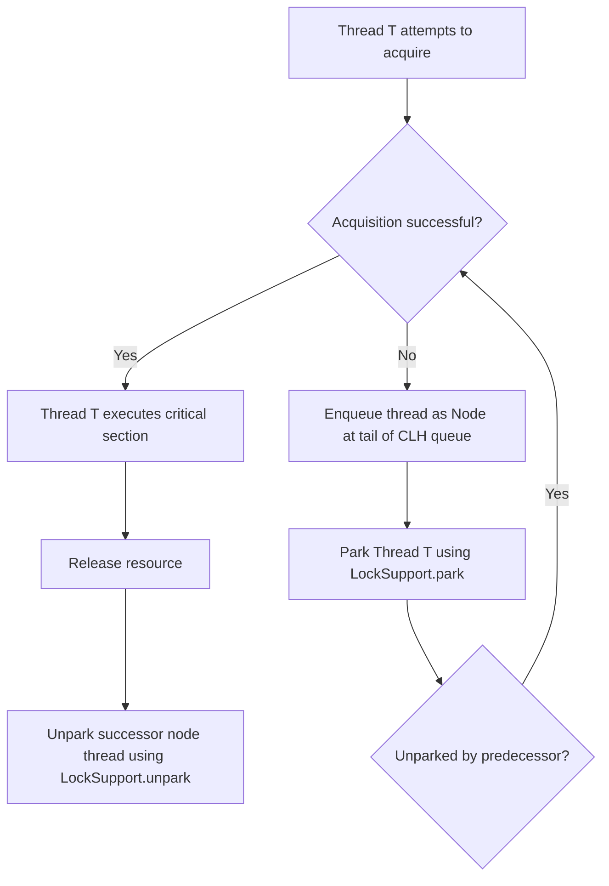

# Java Interview Questions (Advanced Level)

## 151. What is `AbstractQueuedSynchronizer` (AQS) in Java, and how does it serve as the foundation for modern concurrency utilities like `ReentrantLock`, `Semaphore`, and `CountDownLatch`?

`AbstractQueuedSynchronizer` (commonly known as **AQS**), located in the `java.util.concurrent.locks` package, is a framework and a state-based template class designed for building locks and other synchronizers (such as semaphores, barriers, and latches) that rely on first-in-first-out (FIFO) wait queues.

Designed by Doug Lea, AQS handles the low-level, complex mechanics of thread queuing, synchronization state management, and thread blocking/unblocking, allowing developers to write custom synchronizers by implementing only a few high-level methods.

---

### 1. The Core Architecture of AQS

AQS manages synchronization using three main components:

1. **State (`state`)**: A single, `volatile int` variable representing the lock/synchronizer state. AQS provides thread-safe access to this state via:
   - `getState()`
   - `setState(int newState)`
   - `compareAndSetState(int expect, int update)` (utilizes hardware-level Compare-And-Swap (CAS) to update the state atomically).
2. **CLH Queue (Wait Queue)**: A variant of the Craig, Landin, and Hagersten (CLH) lock queue. It is a FIFO, doubly-linked list of `Node` objects. Each node represents a blocked thread waiting for the lock/synchronizer to release.
3. **Exclusive vs. Shared Modes**:
   - **Exclusive Mode (e.g., `ReentrantLock`)**: Only a single thread can hold the resource at any given time. If one thread acquires the state, all other threads attempting to acquire it must wait.
   - **Shared Mode (e.g., `CountDownLatch`, `Semaphore`)**: Multiple threads can successfully acquire the state concurrently.

---

### 2. How AQS Operates Under the Hood

The lifetime of a thread interacting with an AQS-based synchronizer generally flows through these phases:



#### A. Acquisition Flow
1. A thread attempts to acquire the lock/state.
2. If the attempt fails (because the state is already owned or unavailable), AQS creates a new `Node` for the current thread and appends it to the tail of the double-linked CLH queue using a CAS loop to ensure thread safety.
3. Once in the queue, the thread is suspended (parked) using `LockSupport.park(this)`.
4. The thread yields CPU execution and remains parked until it is explicitly unparked by its predecessor node when the state is released.

#### B. Release Flow
1. A thread releases the resource by updating the `state` variable.
2. AQS checks if the new state value permits waiting threads to proceed.
3. If so, it identifies the successor node (the next thread in the queue) and wakes it up using `LockSupport.unpark(thread)`.

---

### 3. The Template Method Pattern in AQS

AQS uses the **Template Method Design Pattern**. It defines the overall structure of locking, queuing, and unparking in its `public final` methods (like `acquire()`, `release()`, `acquireShared()`, `releaseShared()`). Subclasses do not modify these queuing operations. Instead, they define their own state acquisition rules by overriding the following `protected` methods:

| Method Signature | Mode | Description |
| :--- | :--- | :--- |
| `tryAcquire(int arg)` | Exclusive | Attempts to acquire the resource in exclusive mode. Returns `true` if successful. |
| `tryRelease(int arg)` | Exclusive | Attempts to release the resource in exclusive mode. Returns `true` if successful. |
| `tryAcquireShared(int arg)` | Shared | Attempts to acquire the resource in shared mode. Returns a negative integer on failure, `0` on success but no subsequent shared acquires can succeed, or a positive integer if success and subsequent shared acquires may succeed. |
| `tryReleaseShared(int arg)` | Shared | Attempts to release the resource in shared mode. Returns `true` if the release may allow waiting threads to acquire. |
| `isHeldExclusively()` | N/A | Returns `true` if synchronization is held exclusively with respect to the current thread. |

If a subclass does not implement a method, the base AQS class throws an `UnsupportedOperationException`.

---

### 4. How Standard Java Synchronizers Map to AQS

Modern concurrency utilities implement AQS by wrapping it in an internal static helper class (conventionally named `Sync`), which overrides the necessary template methods:

#### A. `ReentrantLock`
- **AQS Mode**: Exclusive.
- **State Semantics**: `state` represents the acquisition count.
  - `state == 0`: The lock is free.
  - `state > 0`: The lock is held. A thread can re-acquire the lock, incrementing `state` (supporting reentrancy).
- **Behavior**: `tryAcquire` succeeds if `state == 0` or if the current thread is the owner. `tryRelease` decrements the state, releasing the lock fully only when `state` reaches `0`.

#### B. `Semaphore`
- **AQS Mode**: Shared.
- **State Semantics**: `state` represents the number of available permits.
- **Behavior**: `tryAcquireShared(acquires)` subtracts the requested permits from the current state. If the result is >= 0, the acquisition succeeds. `tryReleaseShared(releases)` adds permits back to the state using a CAS loop.

#### C. `CountDownLatch`
- **AQS Mode**: Shared.
- **State Semantics**: `state` represents the remaining countdown latch count.
- **Behavior**: `await()` calls `acquireSharedInterruptibly(1)`, which blocks as long as `state > 0`. `countDown()` calls `releaseShared(1)`, which decrements the state. When `state` reaches `0`, the AQS finisher unparks all waiting threads.

---

### 5. Code Example: Implementing a Custom Mutual Exclusion Lock

The following code demonstrates how to implement a basic, non-reentrant custom mutual exclusion (mutex) lock using AQS:

```java
import java.util.concurrent.TimeUnit;
import java.util.concurrent.locks.AbstractQueuedSynchronizer;
import java.util.concurrent.locks.Condition;
import java.util.concurrent.locks.Lock;

public class CustomMutex implements Lock {

    // 1. Define the internal AQS helper class
    private static class Sync extends AbstractQueuedSynchronizer {
        
        // Reports whether the lock is held
        @Override
        protected boolean isHeldExclusively() {
            return getState() == 1;
        }

        // Acquires the lock if state is 0
        @Override
        protected boolean tryAcquire(int acquires) {
            assert acquires == 1; // Mutex requires exactly 1 acquire
            if (compareAndSetState(0, 1)) {
                setExclusiveOwnerThread(Thread.currentThread());
                return true;
            }
            return false;
        }

        // Releases the lock by resetting state to 0
        @Override
        protected boolean tryRelease(int releases) {
            assert releases == 1; // Mutex requires exactly 1 release
            if (getState() == 0) {
                throw new IllegalMonitorStateException();
            }
            setExclusiveOwnerThread(null);
            setState(0);
            return true;
        }

        // Provides a condition interface
        Condition newCondition() {
            return new ConditionObject();
        }
    }

    // 2. Delegate Lock operations to the Sync helper instance
    private final Sync sync = new Sync();

    @Override
    public void lock() {
        sync.acquire(1);
    }

    @Override
    public void lockInterruptibly() throws InterruptedException {
        sync.acquireInterruptibly(1);
    }

    @Override
    public boolean tryLock() {
        return sync.tryAcquire(1);
    }

    @Override
    public boolean tryLock(long time, TimeUnit unit) throws InterruptedException {
        return sync.tryAcquireNanos(1, unit.toNanos(time));
    }

    @Override
    public void unlock() {
        sync.release(1);
    }

    @Override
    public Condition newCondition() {
        return sync.newCondition();
    }
}
```

---

### Summary

- **AQS** acts as a unified skeleton framework for Java synchronizers, hiding the complexity of thread queuing, parking, and waking.
- It relies on a **`volatile int state`** representing the synchronization state, and a **doubly-linked CLH queue** of waiting threads.
- Subclasses use the **Template Method pattern**, implementing only the rules for state transition (`tryAcquire`, `tryRelease`, etc.) using lock-free CAS instructions, while AQS handles thread safety and scheduling under the hood.
