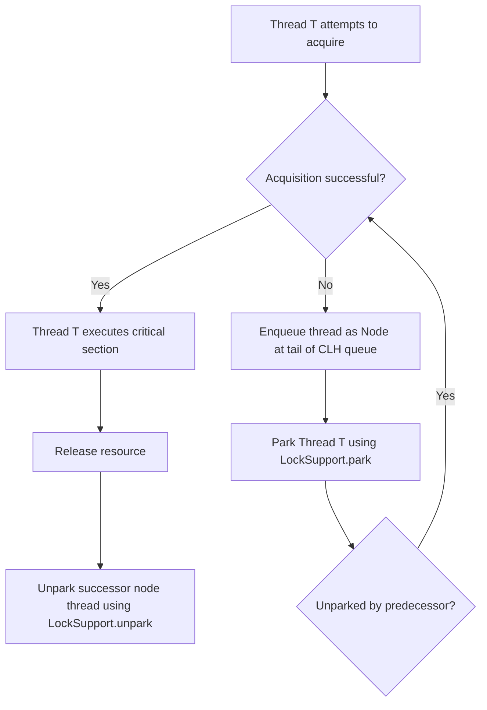
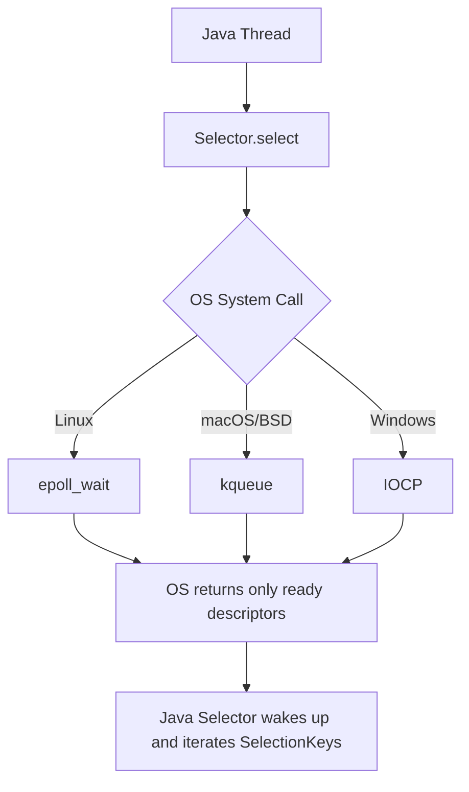

# Java Interview Questions (Advanced Level)

## 151. What is `AbstractQueuedSynchronizer` (AQS) in Java, and how does it serve as the foundation for modern concurrency utilities like `ReentrantLock`, `Semaphore`, and `CountDownLatch`?

`AbstractQueuedSynchronizer` (commonly known as **AQS**), located in the `java.util.concurrent.locks` package, is a framework and a state-based template class designed for building locks and other synchronizers (such as semaphores, barriers, and latches) that rely on first-in-first-out (FIFO) wait queues.

Designed by Doug Lea, AQS handles the low-level, complex mechanics of thread queuing, synchronization state management, and thread blocking/unblocking, allowing developers to write custom synchronizers by implementing only a few high-level methods.

---

### 1. The Core Architecture of AQS

AQS manages synchronization using three main components:

1. **State (`state`)**: A single, `volatile int` variable representing the lock/synchronizer state. AQS provides thread-safe access to this state via:
   - `getState()`
   - `setState(int newState)`
   - `compareAndSetState(int expect, int update)` (utilizes hardware-level Compare-And-Swap (CAS) to update the state atomically).
2. **CLH Queue (Wait Queue)**: A variant of the Craig, Landin, and Hagersten (CLH) lock queue. It is a FIFO, doubly-linked list of `Node` objects. Each node represents a blocked thread waiting for the lock/synchronizer to release.
3. **Exclusive vs. Shared Modes**:
   - **Exclusive Mode (e.g., `ReentrantLock`)**: Only a single thread can hold the resource at any given time. If one thread acquires the state, all other threads attempting to acquire it must wait.
   - **Shared Mode (e.g., `CountDownLatch`, `Semaphore`)**: Multiple threads can successfully acquire the state concurrently.

---

### 2. How AQS Operates Under the Hood

The lifetime of a thread interacting with an AQS-based synchronizer generally flows through these phases:



#### A. Acquisition Flow
1. A thread attempts to acquire the lock/state.
2. If the attempt fails (because the state is already owned or unavailable), AQS creates a new `Node` for the current thread and appends it to the tail of the double-linked CLH queue using a CAS loop to ensure thread safety.
3. Once in the queue, the thread is suspended (parked) using `LockSupport.park(this)`.
4. The thread yields CPU execution and remains parked until it is explicitly unparked by its predecessor node when the state is released.

#### B. Release Flow
1. A thread releases the resource by updating the `state` variable.
2. AQS checks if the new state value permits waiting threads to proceed.
3. If so, it identifies the successor node (the next thread in the queue) and wakes it up using `LockSupport.unpark(thread)`.

---

### 3. The Template Method Pattern in AQS

AQS uses the **Template Method Design Pattern**. It defines the overall structure of locking, queuing, and unparking in its `public final` methods (like `acquire()`, `release()`, `acquireShared()`, `releaseShared()`). Subclasses do not modify these queuing operations. Instead, they define their own state acquisition rules by overriding the following `protected` methods:

| Method Signature | Mode | Description |
| :--- | :--- | :--- |
| `tryAcquire(int arg)` | Exclusive | Attempts to acquire the resource in exclusive mode. Returns `true` if successful. |
| `tryRelease(int arg)` | Exclusive | Attempts to release the resource in exclusive mode. Returns `true` if successful. |
| `tryAcquireShared(int arg)` | Shared | Attempts to acquire the resource in shared mode. Returns a negative integer on failure, `0` on success but no subsequent shared acquires can succeed, or a positive integer if success and subsequent shared acquires may succeed. |
| `tryReleaseShared(int arg)` | Shared | Attempts to release the resource in shared mode. Returns `true` if the release may allow waiting threads to acquire. |
| `isHeldExclusively()` | N/A | Returns `true` if synchronization is held exclusively with respect to the current thread. |

If a subclass does not implement a method, the base AQS class throws an `UnsupportedOperationException`.

---

### 4. How Standard Java Synchronizers Map to AQS

Modern concurrency utilities implement AQS by wrapping it in an internal static helper class (conventionally named `Sync`), which overrides the necessary template methods:

#### A. `ReentrantLock`
- **AQS Mode**: Exclusive.
- **State Semantics**: `state` represents the acquisition count.
  - `state == 0`: The lock is free.
  - `state > 0`: The lock is held. A thread can re-acquire the lock, incrementing `state` (supporting reentrancy).
- **Behavior**: `tryAcquire` succeeds if `state == 0` or if the current thread is the owner. `tryRelease` decrements the state, releasing the lock fully only when `state` reaches `0`.

#### B. `Semaphore`
- **AQS Mode**: Shared.
- **State Semantics**: `state` represents the number of available permits.
- **Behavior**: `tryAcquireShared(acquires)` subtracts the requested permits from the current state. If the result is >= 0, the acquisition succeeds. `tryReleaseShared(releases)` adds permits back to the state using a CAS loop.

#### C. `CountDownLatch`
- **AQS Mode**: Shared.
- **State Semantics**: `state` represents the remaining countdown latch count.
- **Behavior**: `await()` calls `acquireSharedInterruptibly(1)`, which blocks as long as `state > 0`. `countDown()` calls `releaseShared(1)`, which decrements the state. When `state` reaches `0`, the AQS finisher unparks all waiting threads.

---

### 5. Code Example: Implementing a Custom Mutual Exclusion Lock

The following code demonstrates how to implement a basic, non-reentrant custom mutual exclusion (mutex) lock using AQS:

```java
import java.util.concurrent.TimeUnit;
import java.util.concurrent.locks.AbstractQueuedSynchronizer;
import java.util.concurrent.locks.Condition;
import java.util.concurrent.locks.Lock;

public class CustomMutex implements Lock {

    // 1. Define the internal AQS helper class
    private static class Sync extends AbstractQueuedSynchronizer {
        
        // Reports whether the lock is held
        @Override
        protected boolean isHeldExclusively() {
            return getState() == 1;
        }

        // Acquires the lock if state is 0
        @Override
        protected boolean tryAcquire(int acquires) {
            assert acquires == 1; // Mutex requires exactly 1 acquire
            if (compareAndSetState(0, 1)) {
                setExclusiveOwnerThread(Thread.currentThread());
                return true;
            }
            return false;
        }

        // Releases the lock by resetting state to 0
        @Override
        protected boolean tryRelease(int releases) {
            assert releases == 1; // Mutex requires exactly 1 release
            if (getState() == 0) {
                throw new IllegalMonitorStateException();
            }
            setExclusiveOwnerThread(null);
            setState(0);
            return true;
        }

        // Provides a condition interface
        Condition newCondition() {
            return new ConditionObject();
        }
    }

    // 2. Delegate Lock operations to the Sync helper instance
    private final Sync sync = new Sync();

    @Override
    public void lock() {
        sync.acquire(1);
    }

    @Override
    public void lockInterruptibly() throws InterruptedException {
        sync.acquireInterruptibly(1);
    }

    @Override
    public boolean tryLock() {
        return sync.tryAcquire(1);
    }

    @Override
    public boolean tryLock(long time, TimeUnit unit) throws InterruptedException {
        return sync.tryAcquireNanos(1, unit.toNanos(time));
    }

    @Override
    public void unlock() {
        sync.release(1);
    }

    @Override
    public Condition newCondition() {
        return sync.newCondition();
    }
}
```

---

### Summary

- **AQS** acts as a unified skeleton framework for Java synchronizers, hiding the complexity of thread queuing, parking, and waking.
- It relies on a **`volatile int state`** representing the synchronization state, and a **doubly-linked CLH queue** of waiting threads.
- Subclasses use the **Template Method pattern**, implementing only the rules for state transition (`tryAcquire`, `tryRelease`, etc.) using lock-free CAS instructions, while AQS handles thread safety and scheduling under the hood.

---

## 152. How does Java NIO (Non-blocking I/O) achieve scalability compared to traditional blocking I/O (BIO)? Explain the roles of Buffers, Channels, and Selectors, and how they map to OS-level I/O multiplexing (such as `epoll` or `kqueue`).

Traditional Java Blocking I/O (BIO) relies on a **thread-per-connection** model. When a server handles thousands of concurrent clients, it must allocate a dedicated thread for each socket connection. Since threads block on read/write operations, this model consumes massive memory (JVM thread stack overhead) and degrades performance due to constant CPU context switching.

Java Non-blocking I/O (NIO) (introduced in Java 1.4 and enhanced with NIO.2 in Java 7) addresses this limitation by using **I/O multiplexing**, allowing a single thread (or a small pool of threads) to manage multiple concurrent socket channels.

---

### 1. The Core Components of Java NIO

Java NIO is built around three primary abstractions:

#### A. Buffers (`java.nio.Buffer`)
Unlike BIO, where data is read directly from and written to streams (`InputStream`/`OutputStream`) byte-by-byte, NIO reads and writes data via **Buffers**. A Buffer is a contiguous memory block that acts as a temporary container.
- **Direct Buffers (`ByteBuffer.allocateDirect`)**: Allocated outside the standard JVM garbage-collected heap (off-heap memory) via native system calls. Direct buffers avoid copying data between the JVM heap and the native OS buffer during network I/O, yielding higher throughput.
- **Non-Direct Buffers (`ByteBuffer.allocate`)**: Standard heap-allocated buffers that are subject to Garbage Collection.

#### B. Channels (`java.nio.channels.Channel`)
A Channel represents an open connection to an entity capable of I/O operations (e.g., a file, socket, or pipe).
- **Bidirectional**: Unlike BIO streams, which are unidirectional (e.g., `FileInputStream` can only read), Channels can perform both read and write operations.
- **Non-Blocking Support**: Channels (such as `SocketChannel` and `ServerSocketChannel`) can be placed in non-blocking mode (`channel.configureBlocking(false)`), allowing read/write attempts to return immediately instead of pausing execution.

#### C. Selectors (`java.nio.channels.Selector`)
A Selector is a multiplexer of `SelectableChannel` objects. A single thread registers multiple channels with a Selector, along with the interest events it wants to monitor:
- `SelectionKey.OP_ACCEPT`: Server socket is ready to accept a new connection.
- `SelectionKey.OP_CONNECT`: Client socket completed its connection handshake.
- `SelectionKey.OP_READ`: Channel has data ready to be read.
- `SelectionKey.OP_WRITE`: Channel is ready to write data.

---

### 2. Mapping NIO to OS-Level I/O Multiplexing

Under the hood, Java NIO does not implement the selection logic itself. Instead, the JVM delegates it to the underlying Operating System's I/O multiplexing system calls.



#### A. `select()` and `poll()` (The Legacy $O(N)$ Approach)
Older OS multiplexing models like `select()` and `poll()` require the kernel to iterate over a list of all monitored file descriptors to see which ones are ready. When a socket has data, the system call wakes up the application, which must also loop through the entire list ($O(N)$ complexity). This degrades rapidly as the number of connections grows.

#### B. `epoll` (Linux) and `kqueue` (macOS/BSD) (The Scalable $O(1)$ Approach)
Modern operating systems use event-driven system calls. When using `epoll` on Linux:
1. **Registration**: When a channel is registered with a Selector, Java calls `epoll_ctl()` to add the socket's file descriptor to the OS interest list.
2. **Waiting**: Calling `Selector.select()` triggers `epoll_wait()`. The thread goes to sleep.
3. **Interrupt Event**: When data arrives at a network interface card (NIC), the NIC triggers a hardware interrupt. The kernel handles the packet and pushes the socket's file descriptor directly into a **ready list** (event queue).
4. **Wake Up**: The `epoll_wait()` call returns immediately with *only* the file descriptors in the ready list. The thread wakes up. The complexity of finding ready connections is $O(1)$, independent of the total number of idle connections.

---

### 3. Code Example: Implementing a Simple NIO Echo Server

The following code illustrates a single-threaded server managing multiple connections using `Selector`:

```java
import java.io.IOException;
import java.net.InetSocketAddress;
import java.nio.ByteBuffer;
import java.nio.channels.*;
import java.util.Iterator;
import java.util.Set;

public class NioEchoServer {
    public static void main(String[] args) throws IOException {
        // 1. Open Server Socket Channel and Selector
        ServerSocketChannel serverChannel = ServerSocketChannel.open();
        Selector selector = Selector.open();

        serverChannel.bind(new InetSocketAddress("localhost", 8080));
        serverChannel.configureBlocking(false); // Set to non-blocking

        // 2. Register Server Channel with Selector for ACCEPT events
        serverChannel.register(selector, SelectionKey.OP_ACCEPT);
        System.out.println("Echo server started on port 8080...");

        ByteBuffer buffer = ByteBuffer.allocate(256);

        // 3. Event loop
        while (true) {
            // Blocks until at least one registered channel has an event
            selector.select();

            Set<SelectionKey> selectedKeys = selector.selectedKeys();
            Iterator<SelectionKey> keyIterator = selectedKeys.iterator();

            while (keyIterator.hasNext()) {
                SelectionKey key = keyIterator.next();
                keyIterator.remove(); // Prevent reprocessing the same key

                if (key.isAcceptable()) {
                    // Accept the incoming connection
                    SocketChannel clientChannel = serverChannel.accept();
                    clientChannel.configureBlocking(false);
                    // Register the client channel for READ events
                    clientChannel.register(selector, SelectionKey.OP_READ);
                    System.out.println("Accepted connection from: " + clientChannel.getRemoteAddress());
                } 
                
                else if (key.isReadable()) {
                    SocketChannel clientChannel = (SocketChannel) key.channel();
                    buffer.clear();
                    int bytesRead = clientChannel.read(buffer);

                    if (bytesRead == -1) {
                        // Connection closed by client
                        System.out.println("Connection closed by: " + clientChannel.getRemoteAddress());
                        clientChannel.close();
                    } else if (bytesRead > 0) {
                        // Echo the received data back to the client
                        buffer.flip(); // Prepare buffer for reading/writing out
                        clientChannel.write(buffer);
                    }
                }
            }
        }
    }
}
```

---

### 4. Comparison: Java BIO vs. Java NIO

| Feature | Java BIO (Blocking I/O) | Java NIO (Non-blocking I/O) |
| :--- | :--- | :--- |
| **I/O Model** | Stream-oriented (Unidirectional). | Buffer & Channel-oriented (Bidirectional). |
| **Blocking Behavior**| Blocking (Thread halts until operation finishes). | Non-blocking (Thread can poll or multiplex events). |
| **Concurrency Model**| Thread-per-connection (Scales poorly). | Reactor / Event-Loop using Selector (Scales well). |
| **OS Mechanism** | Sequential system calls (`read`/`write`). | OS I/O multiplexing (`epoll`, `kqueue`, `IOCP`). |
| **Best Suited For** | Low-concurrency, simple, high-bandwidth streaming. | High-concurrency, low-latency, many short-lived connections. |

---

### Summary

- **Java NIO** achieves high scalability by decoupling connections from threads through **I/O multiplexing**.
- **Buffers** act as the memory carriers (with direct buffers bypassing JVM heap copy overhead), while **Channels** act as non-blocking conduits.
- The **Selector** acts as the central orchestrator, delegating connection monitoring to OS-level constructs like **`epoll`** (Linux) or **`kqueue`** (macOS) to achieve $O(1)$ event notifications, enabling a single thread to handle tens of thousands of active channels.

